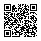
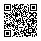
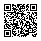

# QR camera test

Sample codes in the real Sahra format (QR version and size exactly as real tickets),
with random contents: they are not valid tickets. Open this page on phone A, set its
screen brightness LOW, and scan each code with phone B's camera app. Note for each:
read or not, and roughly how long it took. Also try at about 30 cm and at an angle.

| Code | Characters | QR version | Size |
|---|---|---|---|
| 1. typical | 62 | 4 (level M, Alphanumeric) | 33 x 33 |
| 2. longest party id | 74 | 4 (level M, Alphanumeric) | 33 x 33 |
| 3. longest possible | 79 | 4 (level M, Alphanumeric) | 33 x 33 |

## 1. typical

`S1.CHECKPOINT-A.1S51H6GYYNW0WT25Q.1.STPQ92KSQK3QBDCSPFD731T1W3`

## 2. longest party id

`S1.HALLOWEEN-26-ARCHIVE-XYZ.143JY7E928F8E1X7W.1.72X0NK1PC0M8Y7S439PS4TQ92Z`

## 3. longest possible

`S1.AAAAAAAAAAAAAAAAAAAAAAAA.1CCJ2AEDM897QWNJG.999999.2WT6SXWB0MSR93ABJNKBKXK0Y4`

